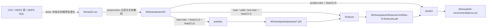

# UniSRec 序列推荐

本项目基于 [RUCAIBox/UniSRec](https://github.com/RUCAIBox/UniSRec) 改造，使用 RecBole、PyTorch 和商品文本向量构建序列推荐流水线。数据集名称只用于文件和模型命名，不限定数据来源。通过 Bash 入口 `run.sh` 可以按顺序执行完整流程，也可以独立执行任一阶段。

## 项目结构

```text
run.sh                         完整流水线与独立阶段入口
unisrec.py                     模型定义
pretrain.py                    预训练入口
finetune.py                    微调入口
predict.py                     纯模型 TopK 推理与 CSV 输出
recbole_data/                  RecBole 数据集、加载器、数据增强
data_pipeline/raw/             CSV 标准化与 ODPS 取数
data_pipeline/preprocessing/   交互清洗、原子文件和文本向量生成
configs/                       训练配置
docs/                          训练阶段说明
tests/                         入口及数据契约测试
outputs/                       默认产物目录，由 Git 忽略
```

`data_pipeline/preprocessing/preprocessing_utils.py` 分别生成严格留出的训练评估序列和完整历史的生产预测序列。

## 数据契约

### 交互数据

`fetch` 接收 CSV 文件、ODPS 表或 ODPS SQL 文件。统一后的 CSV 位于 `W/raw/<dataset>.csv`，其中 `W` 表示 `--work-dir`。以下五列是本项目为数据接入定义的内部字段，**不是上游 UniSRec 要求的原始数据字段**；允许源文件有额外列且列顺序任意：

| 字段 | 含义 | 格式示例 |
| --- | --- | --- |
| `user_id` | 原始用户 ID | `u001` |
| `item_id` | 原始商品或内容 ID | `i001` |
| `event_value` | 交互权重；当前预处理会读取为数字 | `1` |
| `event_time` | 交互日期；用于用户序列排序 | `2026-01-01` |
| `item_text` | 文本编码器使用的商品描述 | `Item title and attributes` |

本项目早期 ODPS 导出字段 `user_id,prod_id,purchase_count,dt,attrvalues` 也可被 `fetch` 转换为上述统一格式，无需修改原 ODPS 表。上游 UniSRec 的原始数据预处理因数据集而异；本项目预处理后生成的 RecBole 原子文件使用 `user_id`、`item_id_list`、`item_id` 等模型输入字段，以及商品文本向量文件。预处理跳过原始字段中有空值的行；日期需要是 `YYYY-MM-DD`。`--input-table` 会读取表的全部行；需要日期过滤、列别名或其他查询条件时，使用 `--input-query-file` 提供 SQL。当前预处理依赖商品文本，不能仅凭用户和商品 ID 训练。

## 环境与目录

安装 `requirements.txt`，并准备本地文本编码器目录。文件中的 PyTorch 构建面向 CUDA 11.6，应使用匹配的运行环境。ODPS 模式在项目根目录的 `.env` 中读取连接参数，也可用 `--env-file` 指定其他文件；`.env` 已被 Git 忽略：

```dotenv
access_id=your_access_id
access_key=your_access_key
project=your_project
endpoint=https://your-maxcompute-endpoint/api
```

默认工作目录是项目内的 `outputs/`，目录布局如下：

```text
outputs/
├── raw/<dataset>.csv
├── downstream/<dataset>/
│   ├── <dataset>.train.inter / .valid.inter / .test.inter / .predict.inter
│   ├── <dataset>.feat1CLS / .feat2CLS
│   └── index2user.json / index2item.json
├── checkpoints/pretrain/*.pth
├── checkpoints/finetune/UniSRec-<dataset>-finetuned.pth
└── results/<dataset>-recommendations.csv
```

在 PAI 可视化建模组件中，用 `--work-dir "$PAI_OUTPUT_DIR"` 指向组件实际挂载的输出目录；`PAI_OUTPUT_DIR` 是示例变量，需由部署环境设置。所有阶段使用相同工作目录。凭据与文本编码器也可分别通过 `--env-file`、`--plm-path` 指向部署环境的实际位置，仓库不包含固定挂载路径。

`fetch` 的四个主要参数分别是：`--dataset` 指定输出 CSV 的文件名主体，`--input-table` 指定 ODPS 来源表，`--env-file` 指定连接配置，`--work-dir` 指定整个流水线的工作目录。`--dataset` 和一种输入源必须提供；后两个参数省略时分别使用项目根目录的 `.env` 和 `outputs/`。使用 CSV 或 SQL 文件作为来源时，将 `--input-table` 分别替换成 `--input-csv` 或 `--input-query-file`，三者只能选一个。

只从 ODPS 表下载交互数据：

```bash
bash run.sh --stage fetch \
  --dataset catalog \
  --input-table your_interaction_table \
  --env-file /path/to/.env \
  --work-dir "$PAI_OUTPUT_DIR"
```

该命令生成 `$PAI_OUTPUT_DIR/raw/catalog.csv`。`--work-dir` 是后续预处理、训练和预测共用的目录，不只是下载目录。`fetch` 不需要 `--plm-path` 或预测参数。

## 完整流程

使用 CSV 输入，并将推荐结果写入 CSV：

```bash
bash run.sh --stage all --dataset catalog \
  --input-csv /path/to/interactions.csv \
  --plm-path /path/to/text_encoder \
  --max-seq-length 50 \
  --top-k 50 \
  --work-dir /path/to/work_dir
```

ODPS 输入时，把 `--input-csv` 替换为 `--input-table your_interaction_table`，或使用 `--input-query-file /path/to/query.sql`，并用 `--env-file /path/to/.env` 指向连接配置。预测阶段只读取预处理数据和微调模型，不连接 ODPS。

查询文件必须返回交互数据契约中的五列，历史字段也受支持。需要原来的近期交互窗口时，可在 SQL 中继续使用日期条件。请审查实际 SQL。

`bash run.sh --help` 列出所有参数。省略 `--stage` 等同于 `--stage all`。

每个阶段开始时打印数据集、工作目录、主要输入和输出路径；完成时打印耗时。阶段失败时打印阶段名、退出码和耗时，完整流水线随即停止。日志不输出 `.env` 的凭据内容。

### 使用 nohup 后台执行

`nohup` 可以包装本项目的完整流水线或任意独立阶段，并不限定于训练命令。它使进程忽略 SSH
会话断开产生的 `SIGHUP` 信号；末尾的 `&` 将命令放到后台，`> ... 2>&1` 将标准输出和错误
统一写入日志。通用形式如下，其中 `RUN_SH_OPTIONS` 表示原命令的全部参数：

```bash
mkdir -p "$WORK_DIR/logs"
nohup bash run.sh RUN_SH_OPTIONS > "$WORK_DIR/logs/pipeline.out" 2>&1 &
echo $!
```

例如，将前面的完整流水线放到后台运行：

```bash
WORK_DIR=/path/to/work_dir
mkdir -p "$WORK_DIR/logs"

nohup bash run.sh --stage all --dataset catalog \
  --input-csv /path/to/interactions.csv \
  --plm-path /path/to/text_encoder \
  --max-seq-length 50 \
  --work-dir "$WORK_DIR" \
  --python /absolute/path/to/conda/envs/unisrec/bin/python3 \
  > "$WORK_DIR/logs/pipeline.out" 2>&1 &

echo $!
```

同样的写法适用于 `fetch`、`preprocess`、`pretrain`、`finetune` 和 `predict`：保持对应阶段原有的
参数不变，只在命令前增加 `nohup`，并在末尾增加日志重定向和 `&`。`echo $!` 输出后台 Bash
进程 PID。重新连接 SSH 后可执行：

```bash
# 实时查看日志；Ctrl+C 只退出日志查看，不会停止后台任务
tail -f "$WORK_DIR/logs/pipeline.out"

# 查看各阶段的开始、完成或失败状态
grep -aE "stage=.* (START|COMPLETE|FAILED)" "$WORK_DIR/logs/pipeline.out"

# 查找仍在运行的流水线及各阶段 Python 进程
pgrep -af "run.sh|prepare_interactions.py|preprocess.py|pretrain.py|finetune.py|predict.py"
```

`nohup` 只避免进程随 SSH 会话断开而退出，不能防止 Pod 重启、删除、驱逐、平台任务超时、
OOM 或节点故障。不要为同一个数据集和工作目录同时启动相同阶段，否则可能同时写入同名文件。

## 数据流与输出



图中 `D` 是 `--dataset` 的值。现有用户和商品交互次数过滤后，预处理对每位用户保留最近 `--max-seq-length` 次交互（默认 50，范围 3–100）。训练使用除最后两次外的交互，倒数第二次作为验证目标，最后一次作为测试目标；`predict.inter` 使用保留的完整序列供生产预测。预测为全部预测用户计算全量商品分数，屏蔽 padding 和用户完整输入序列中的历史商品，然后按分数降序直接选择最多 `--top-k` 个商品。

预测只生成 `<dataset>-recommendations.csv`，采用逐条推荐格式 `user_id,item_id,score`。每位用户的结果按模型分数降序写入；可推荐的未交互商品少于 `--top-k` 时，该用户的输出行数会相应减少。

## 各阶段 Bash 命令与参数

所有流程都通过 `bash run.sh` 执行。运行前可先定义公共路径，以下示例均使用这些变量：

```bash
PROJECT_DIR=/path/to/Unisrec_1
WORK_DIR=/path/to/work_dir
PYTHON_BIN=/absolute/path/to/conda/envs/unisrec/bin/python3

cd "$PROJECT_DIR"
```

### 公共约定

| 参数 | 是否必填 | 默认值 | 含义与限制 |
| --- | --- | --- | --- |
| `--stage NAME` | 建议显式指定 | `all` | 可选值：`all`、`fetch`、`preprocess`、`pretrain`、`finetune`、`predict`。 |
| `--dataset NAME` | 是 | 无 | 数据集标识，用于目录和文件命名。只能包含英文字母、数字、下划线，且必须以英文字母开头。 |
| `--work-dir DIR` | 否 | 项目内 `outputs/` | 全流程共享的工作目录。独立执行各阶段时必须使用同一目录。不存在时自动创建并转换为绝对路径。 |
| `--python EXECUTABLE` | 否 | `python3` | 执行 Python 脚本的解释器。必须能被当前环境找到；使用 `nohup` 时建议传入 Conda 环境中的绝对路径。 |
| `-h`、`--help` | 否 | 无 | 打印 `run.sh` 支持的全部 Bash 参数后退出。 |

只有当前阶段表格中列出的参数才应传入该阶段。以下三项只能用于对应的独立阶段，传给其他阶段或 `all` 会直接报错：

- `--resume-checkpoint`：仅用于 `pretrain`。
- `--pretrained-checkpoint`：仅用于 `finetune`。
- `--finetuned-checkpoint`：仅用于 `predict`。

### 0. all：按顺序执行完整流水线

执行顺序固定为：`fetch → preprocess → pretrain → finetune → predict`。任一阶段失败，后续阶段不会执行。

#### CSV 输入示例

```bash
bash run.sh --stage all \
  --dataset catalog \
  --input-csv /path/to/interactions.csv \
  --plm-path /path/to/text_encoder \
  --max-seq-length 50 \
  --top-k 50 \
  --work-dir "$WORK_DIR" \
  --python "$PYTHON_BIN"
```

#### 可执行参数

| 参数 | 是否必填 | 默认值 | 说明 |
| --- | --- | --- | --- |
| `--stage all` | 否 | `all` | 明确执行完整流水线。建议保留，便于阅读命令。 |
| `--dataset NAME` | 是 | 无 | 全部阶段共用的数据集标识。 |
| `--input-csv FILE` | 三选一 | 无 | 从已有交互 CSV 读取数据。必须与 `--input-table`、`--input-query-file` 三选一。 |
| `--input-table NAME` | 三选一 | 无 | 读取 ODPS 交互表的全部行。必须与另外两种交互来源三选一。 |
| `--input-query-file FILE` | 三选一 | 无 | 执行文件中的 ODPS SQL。适合日期过滤、字段别名和复杂查询。 |
| `--plm-path DIR` | 否 | 项目内 `bert-base-uncased/` | 本地文本编码器目录；目录必须存在。 |
| `--max-seq-length N` | 否 | `50` | 每位用户保留的最近交互数，必须是 `3–100` 的整数。 |
| `--top-k NUMBER` | 否 | `50` | 每位用户最多输出的推荐数，必须是正整数。 |
| `--env-file FILE` | ODPS 输入使用 | 项目根目录 `.env` | `--input-table` 或 `--input-query-file` 模式的连接配置。纯 CSV 流程与预测阶段不读取。 |
| `--work-dir DIR` | 否 | 项目内 `outputs/` | 保存所有中间数据、检查点和预测结果。 |
| `--python EXECUTABLE` | 否 | `python3` | 全部 Python 阶段使用的解释器。 |

`all` 自动把本次预训练的最后一个检查点交给微调，再把本次微调模型交给预测。因此不能给 `all` 传入三个独立阶段检查点参数。

#### 主要输出

```text
<work-dir>/raw/<dataset>.csv
<work-dir>/downstream/<dataset>/
<work-dir>/checkpoints/pretrain/*.pth
<work-dir>/checkpoints/finetune/UniSRec-<dataset>-finetuned.pth
<work-dir>/results/<dataset>-recommendations.csv
```

### 1. fetch：准备标准交互 CSV

`fetch` 将 CSV、ODPS 表或 ODPS SQL 的结果统一为项目内部五字段 CSV。

#### ODPS 表输入示例

```bash
bash run.sh --stage fetch \
  --dataset catalog \
  --input-table your_interaction_table \
  --env-file /path/to/.env \
  --work-dir "$WORK_DIR" \
  --python "$PYTHON_BIN"
```

#### 可执行参数

| 参数 | 是否必填 | 默认值 | 说明 |
| --- | --- | --- | --- |
| `--stage fetch` | 是 | 无 | 只执行数据获取与字段标准化。 |
| `--dataset NAME` | 是 | 无 | 输出文件名主体。 |
| `--input-csv FILE` | 三选一 | 无 | 已有 CSV 文件；需符合标准字段或兼容的历史字段。 |
| `--input-table NAME` | 三选一 | 无 | ODPS 交互表名；读取表的全部行。 |
| `--input-query-file FILE` | 三选一 | 无 | 包含 ODPS SQL 的文件；查询结果需符合标准字段或历史字段。 |
| `--env-file FILE` | ODPS 来源使用 | 项目根目录 `.env` | `--input-table` 或 `--input-query-file` 模式的连接配置。CSV 模式不读取该文件。 |
| `--work-dir DIR` | 否 | 项目内 `outputs/` | 标准 CSV 写入 `DIR/raw/`。 |
| `--python EXECUTABLE` | 否 | `python3` | 执行下载和 CSV 标准化脚本。 |

三种来源必须且只能指定一个。`--output-dir` 是内部 Python 脚本参数，不是 `run.sh` 参数。

#### 其他来源示例

```bash
# 已有 CSV
bash run.sh --stage fetch \
  --dataset catalog \
  --input-csv /path/to/interactions.csv \
  --work-dir "$WORK_DIR" \
  --python "$PYTHON_BIN"

# 自定义 ODPS SQL
bash run.sh --stage fetch \
  --dataset catalog \
  --input-query-file /path/to/query.sql \
  --env-file /path/to/.env \
  --work-dir "$WORK_DIR" \
  --python "$PYTHON_BIN"
```

#### 输入与输出

- 标准字段：`user_id,item_id,event_value,event_time,item_text`。
- 兼容历史字段：`user_id,prod_id,purchase_count,dt,attrvalues`。
- 输出：`<work-dir>/raw/<dataset>.csv`。

### 2. preprocess：生成序列数据和商品文本向量

#### 执行示例

```bash
bash run.sh --stage preprocess \
  --dataset catalog \
  --plm-path /path/to/text_encoder \
  --max-seq-length 50 \
  --work-dir "$WORK_DIR" \
  --python "$PYTHON_BIN"
```

#### 可执行参数

| 参数 | 是否必填 | 默认值 | 说明 |
| --- | --- | --- | --- |
| `--stage preprocess` | 是 | 无 | 只执行预处理。 |
| `--dataset NAME` | 是 | 无 | 读取同名标准 CSV，并作为产物文件名前缀。 |
| `--plm-path DIR` | 否 | 项目内 `bert-base-uncased/` | 文本编码器目录；必须存在。用于生成商品向量。 |
| `--max-seq-length N` | 否 | `50` | 每位用户保留最近 N 次交互，必须是 `3–100` 的整数。 |
| `--work-dir DIR` | 否 | 项目内 `outputs/` | 输入来自 `DIR/raw/`，产物写入 `DIR/downstream/`。 |
| `--python EXECUTABLE` | 否 | `python3` | 执行预处理和文本编码。 |

#### 前置文件

```text
<work-dir>/raw/<dataset>.csv
```

#### 输出文件

```text
<work-dir>/downstream/<dataset>/<dataset>.train.inter
<work-dir>/downstream/<dataset>/<dataset>.valid.inter
<work-dir>/downstream/<dataset>/<dataset>.test.inter
<work-dir>/downstream/<dataset>/<dataset>.predict.inter
<work-dir>/downstream/<dataset>/<dataset>.feat1CLS
<work-dir>/downstream/<dataset>/<dataset>.feat2CLS
<work-dir>/downstream/<dataset>/index2user.json
<work-dir>/downstream/<dataset>/index2item.json
```

`run.sh` 当前固定使用 `word_drop_ratio=0.2`；用户和商品交互过滤采用预处理脚本默认值。它们不是当前 Bash 入口可指定的参数。

### 3. pretrain：预训练

#### 从头预训练

```bash
bash run.sh --stage pretrain \
  --dataset catalog \
  --work-dir "$WORK_DIR" \
  --python "$PYTHON_BIN"
```

#### 可执行参数

| 参数 | 是否必填 | 默认值 | 说明 |
| --- | --- | --- | --- |
| `--stage pretrain` | 是 | 无 | 只执行预训练。 |
| `--dataset NAME` | 是 | 无 | 指定预处理数据集和检查点文件名前缀。 |
| `--resume-checkpoint FILE` | 否 | 从头训练 | 恢复模型、优化器和训练轮次，从检查点的下一轮继续；文件必须存在且数据集必须一致。 |
| `--work-dir DIR` | 否 | 项目内 `outputs/` | 读取 `DIR/downstream/<dataset>/`，写入 `DIR/checkpoints/pretrain/`。 |
| `--python EXECUTABLE` | 否 | `python3` | 执行预训练。GPU 环境建议使用 Conda Python 的绝对路径。 |

#### 前置文件

```text
<work-dir>/downstream/<dataset>/<dataset>.train.inter
<work-dir>/downstream/<dataset>/<dataset>.feat1CLS
<work-dir>/downstream/<dataset>/<dataset>.feat2CLS
```

#### 从检查点恢复示例

```bash
bash run.sh --stage pretrain \
  --dataset catalog \
  --resume-checkpoint "$WORK_DIR/checkpoints/pretrain/UniSRec-catalog-12.pth" \
  --work-dir "$WORK_DIR" \
  --python "$PYTHON_BIN"
```

`pretrain_epochs` 是包含检查点已完成轮次在内的总轮数。例如从第 12 轮检查点恢复且配置为 50，程序继续执行第 13–50 轮。新检查点写入：

```text
<work-dir>/checkpoints/pretrain/UniSRec-<dataset>-<epoch>.pth
```

### 4. finetune：微调

#### 执行示例

```bash
bash run.sh --stage finetune \
  --dataset catalog \
  --pretrained-checkpoint "$WORK_DIR/checkpoints/pretrain/UniSRec-catalog-50.pth" \
  --work-dir "$WORK_DIR" \
  --python "$PYTHON_BIN"
```

#### 可执行参数

| 参数 | 是否必填 | 默认值 | 说明 |
| --- | --- | --- | --- |
| `--stage finetune` | 是 | 无 | 只执行微调。 |
| `--dataset NAME` | 是 | 无 | 指定预处理数据集和微调模型文件名。 |
| `--pretrained-checkpoint FILE` | 是 | 无 | 预训练检查点；文件必须存在。独立微调不会自动推断该路径。 |
| `--work-dir DIR` | 否 | 项目内 `outputs/` | 读取 `DIR/downstream/<dataset>/`，写入 `DIR/checkpoints/finetune/`。 |
| `--python EXECUTABLE` | 否 | `python3` | 执行微调。 |

#### 前置文件

```text
<work-dir>/downstream/<dataset>/<dataset>.train.inter
<work-dir>/downstream/<dataset>/<dataset>.valid.inter
<work-dir>/downstream/<dataset>/<dataset>.test.inter
<work-dir>/downstream/<dataset>/<dataset>.feat1CLS
<pretrained-checkpoint>
```

#### 输出文件

```text
<work-dir>/checkpoints/finetune/UniSRec-<dataset>-finetuned.pth
```

### 5. predict：生成推荐结果

预测阶段只执行模型推理：读取预处理产生的完整用户序列和商品文本向量，加载微调模型，为全部预测用户生成 TopK 结果并写入一份 CSV。

#### 执行示例

```bash
bash run.sh --stage predict \
  --dataset catalog \
  --finetuned-checkpoint "$WORK_DIR/checkpoints/finetune/UniSRec-catalog-finetuned.pth" \
  --top-k 50 \
  --work-dir "$WORK_DIR" \
  --python "$PYTHON_BIN"
```

#### 可执行参数

| 参数 | 是否必填 | 默认值 | 说明 |
| --- | --- | --- | --- |
| `--stage predict` | 是 | 无 | 只执行预测。 |
| `--dataset NAME` | 是 | 无 | 指定预处理数据集和结果文件名前缀。 |
| `--finetuned-checkpoint FILE` | 否 | `DIR/checkpoints/finetune/UniSRec-NAME-finetuned.pth` | 指定微调模型；省略时使用工作目录中的默认文件。 |
| `--top-k NUMBER` | 否 | `50` | 每位用户最多输出的推荐数，必须是正整数。 |
| `--work-dir DIR` | 否 | 项目内 `outputs/` | 读取预处理产物和默认模型，结果写入 `DIR/results/`。 |
| `--python EXECUTABLE` | 否 | `python3` | 执行模型推理。GPU 环境建议使用 Conda Python 的绝对路径。 |

`predict` 会屏蔽 padding 商品和每位用户输入序列中的全部历史商品，再按模型分数降序写出最多 `--top-k` 条结果。未交互商品不足时，该用户的输出可能少于 `--top-k` 条。

#### 前置文件

```text
<work-dir>/downstream/<dataset>/<dataset>.train.inter
<work-dir>/downstream/<dataset>/<dataset>.valid.inter
<work-dir>/downstream/<dataset>/<dataset>.predict.inter
<work-dir>/downstream/<dataset>/<dataset>.feat1CLS
<work-dir>/downstream/<dataset>/index2user.json
<work-dir>/downstream/<dataset>/index2item.json
<finetuned-checkpoint>
```

#### 输出

```text
<work-dir>/results/<dataset>-recommendations.csv
```

文件只包含三列：

```text
user_id,item_id,score
```

### Bash 参数与 YAML 超参数的边界

`run.sh` 负责数据来源、路径、阶段选择和阶段衔接。训练轮数、学习率、批量大小、模型层数等不通过 Bash 指定，而是在 YAML 中配置：

| 配置文件 | 作用 | 主要参数示例 |
| --- | --- | --- |
| `configs/UniSRec.yaml` | 预训练与微调共享的模型结构 | `n_layers`、`n_heads`、`hidden_size`、`inner_size`、dropout、文本向量和适配器参数。 |
| `configs/pretrain.yaml` | 预训练数据和优化参数 | `pretrain_epochs`、`save_step`、`train_batch_size`、`learning_rate`、`MAX_ITEM_LIST_LENGTH`。 |
| `configs/finetune.yaml` | 微调、验证和早停参数 | `epochs`、`train_batch_size`、`learning_rate`、`weight_decay`、`eval_step`、`stopping_step`、评估指标。 |

例如，调整预训练总轮数或学习率，应修改 `configs/pretrain.yaml`，而不是给 `run.sh` 增加 `--epochs` 或 `--learning-rate`。
