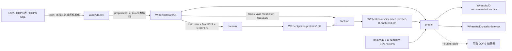

# UniSRec 序列推荐

基于 RecBole、PyTorch 和商品文本向量的序列推荐流水线。数据集名称只用于文件和模型命名，不限定数据来源。通过 Bash 入口 `run.sh` 可以按顺序执行完整流程，也可以独立执行任一阶段。

## 项目结构

```text
run.sh                         完整流水线与独立阶段入口
unisrec.py                     模型定义
pretrain.py                    预训练入口
finetune.py                    微调入口
predict.py                     预测及可选的 ODPS 写表
recbole_data/                  RecBole 数据集、加载器、数据增强
data_pipeline/raw/             CSV 标准化与 ODPS 取数
data_pipeline/preprocessing/   交互清洗、原子文件和文本向量生成
configs/                       训练配置
docs/                          训练阶段说明
tests/                         入口及数据契约测试
outputs/                       默认产物目录，由 Git 忽略
```

`data_pipeline/preprocessing/legacy_preprocessing_utils.py` 是未被当前入口调用的历史划分实现。训练和预测的算法仍在相应脚本中；部署环境提供符合以下字段约定的输入。

## 数据契约

### 交互数据

`fetch` 接收 CSV 文件、ODPS 表或 ODPS SQL 文件。统一后的 CSV 位于 `W/raw/<dataset>.csv`，其中 `W` 表示 `--work-dir`。字段如下，允许源文件有额外列且列顺序任意：

| 字段 | 含义 | 格式示例 |
| --- | --- | --- |
| `user_id` | 原始用户 ID | `u001` |
| `item_id` | 原始商品或内容 ID | `i001` |
| `event_value` | 交互权重；当前预处理会读取为数字 | `1` |
| `event_time` | 交互日期；用于用户序列排序 | `2026-01-01` |
| `item_text` | 文本编码器使用的商品描述 | `Item title and attributes` |

历史 ODPS 导出字段 `user_id,prod_id,purchase_count,dt,attrvalues` 也可被 `fetch` 转换为上述统一格式。预处理跳过这些字段中有空值的行；日期需要是 `YYYY-MM-DD`。`--input-table` 会读取表的全部行；需要日期过滤、列别名或其他查询条件时，使用 `--input-query-file` 提供 SQL。当前预处理依赖商品文本，不能仅凭用户和商品 ID 训练。

### 预测商品信息

预测阶段还需要两份数据，可以分别来自 CSV 或 ODPS 表：

- 商品品类：`item_id,category_id`，用于每个品类最多保留 2 个商品的现有打散规则。
- 可推荐商品：`item_id`，用于筛选当前有效的商品。

CSV 标识符按字符串读取，前导零会保留。ODPS 表也应提供这些列名；不同生产表结构可建立视图，或在导出 CSV 时改列名。ODPS 表名均在运行时传入，项目不依赖固定表名。

## 环境与目录

安装 `requirements.txt`，并准备本地文本编码器目录。文件中的 PyTorch 构建面向 CUDA 11.6，应使用匹配的运行环境。ODPS 模式在项目根目录的 `.env` 中读取连接参数，也可用 `--env-file` 指定其他文件；`.env` 已被 Git 忽略：

```dotenv
access_id=your_access_id
access_key=your_access_key
project=your_project
endpoint=https://your-maxcompute-endpoint/api
```

默认工作目录是项目内的 `outputs/`，目录布局如下：

```text
outputs/
├── raw/<dataset>.csv
├── downstream/<dataset>/
│   ├── <dataset>.train.inter / .valid.inter / .test.inter
│   ├── <dataset>.feat1CLS / .feat2CLS
│   └── index2user.json / index2item.json
├── checkpoints/pretrain/*.pth
├── checkpoints/finetune/UniSRec-<dataset>-finetuned.pth
└── results/
    ├── <dataset>-details-<date>.csv
    └── <dataset>-recommendations.csv
```

在 PAI 可视化建模组件中，用 `--work-dir "$PAI_OUTPUT_DIR"` 指向组件实际挂载的输出目录；`PAI_OUTPUT_DIR` 是示例变量，需由部署环境设置。所有阶段使用相同工作目录。凭据与文本编码器也可分别通过 `--env-file`、`--plm-path` 指向部署环境的实际位置，仓库不包含固定挂载路径。

## 完整流程

使用 CSV 输入，并将推荐结果写入 CSV：

```bash
bash run.sh --stage all --dataset catalog \
  --input-csv /path/to/interactions.csv \
  --item-metadata-csv /path/to/item_metadata.csv \
  --eligible-items-csv /path/to/eligible_items.csv \
  --plm-path /path/to/text_encoder
```

ODPS 输入时，把 `--input-csv` 替换为 `--input-table your_interaction_table`，或使用 `--input-query-file /path/to/query.sql`；预测数据可用 `--item-metadata-table your_metadata_table` 和 `--eligible-items-table your_eligible_items_table`。如需将结果写回 ODPS，传入 `--output-table your_result_table`，并用 `--env-file` 指向连接配置。CSV 与 ODPS 商品信息可以分别选择，不要求来自同一种存储。

查询文件必须返回交互数据契约中的五列，历史字段也受支持。需要原来的近期交互窗口时，可在 SQL 中继续使用日期条件。请审查实际 SQL 和 ODPS 目标表；写表时会删除已有同名表并重建。

`bash run.sh --help` 列出所有参数。省略 `--stage` 等同于 `--stage all`。

迁移已有 ODPS 部署时，需要将原商品信息字段映射为 `item_id,category_id`，将可推荐商品字段映射为 `item_id`。可选结果表现在使用 `user_id,item_id,score`，原先依赖其他列名的下游任务需要同步调整。原来写死的试验用户复制规则已移除，推荐结果只包含真实输入用户。

## 数据流与输出



图中 `D` 是 `--dataset` 的值。预训练和微调使用同一次预处理的数据。当前划分会先把全部交互放入训练序列，取末尾最多 50 个构造训练样本；验证和测试目标均为末次交互，并非独立留出集。预测从全量评分中最多取 800 个候选，按有效商品和品类筛选，最后每用户保留至多 `--top-k` 个；写推荐明细时仅保留历史序列最长的前 150000 名用户。这些规则属于当前业务逻辑。

`<dataset>-recommendations.csv` 和可选 ODPS 表采用相同的逐条推荐格式：`user_id,item_id,score`。`<dataset>-details-<date>.csv` 则用于检查预测，列为 `user_id,history_item_ids,target_item_id,recommended_item_ids,recommendation_scores`；其中列表列是 JSON 数组字符串。结果文件以当前数据集命名，不包含评估指标；命中率打印在日志中。

## 独立运行阶段

每个阶段均通过 Bash 执行。上游阶段的文件应已存在于同一 `--work-dir`；`finetune` 需要预训练阶段打印的权重路径。以下命令以 CSV 为例：

```bash
bash run.sh --stage fetch --dataset catalog --input-csv /path/to/interactions.csv
bash run.sh --stage preprocess --dataset catalog --plm-path /path/to/text_encoder
bash run.sh --stage pretrain --dataset catalog
bash run.sh --stage finetune --dataset catalog --pretrained-checkpoint /path/to/pretrained.pth
bash run.sh --stage predict --dataset catalog \
  --item-metadata-csv /path/to/item_metadata.csv \
  --eligible-items-csv /path/to/eligible_items.csv
```

`predict` 默认从工作目录的 `checkpoints/finetune/` 读取相应数据集的权重，也可用 `--finetuned-checkpoint` 指定。任一阶段失败，完整流水线立即停止。
