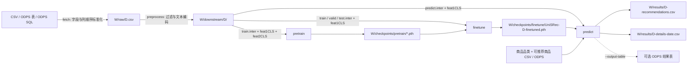

# UniSRec 序列推荐

本项目基于 [RUCAIBox/UniSRec](https://github.com/RUCAIBox/UniSRec) 改造，使用 RecBole、PyTorch 和商品文本向量构建序列推荐流水线。数据集名称只用于文件和模型命名，不限定数据来源。通过 Bash 入口 `run.sh` 可以按顺序执行完整流程，也可以独立执行任一阶段。

## 项目结构

```text
run.sh                         完整流水线与独立阶段入口
unisrec.py                     模型定义
pretrain.py                    预训练入口
finetune.py                    微调入口
predict.py                     预测及可选的 ODPS 写表
recbole_data/                  RecBole 数据集、加载器、数据增强
data_pipeline/raw/             CSV 标准化与 ODPS 取数
data_pipeline/preprocessing/   交互清洗、原子文件和文本向量生成
configs/                       训练配置
docs/                          训练阶段说明
tests/                         入口及数据契约测试
outputs/                       默认产物目录，由 Git 忽略
```

`data_pipeline/preprocessing/preprocessing_utils.py` 分别生成严格留出的训练评估序列和完整历史的生产预测序列。

## 数据契约

### 交互数据

`fetch` 接收 CSV 文件、ODPS 表或 ODPS SQL 文件。统一后的 CSV 位于 `W/raw/<dataset>.csv`，其中 `W` 表示 `--work-dir`。以下五列是本项目为数据接入定义的内部字段，**不是上游 UniSRec 要求的原始数据字段**；允许源文件有额外列且列顺序任意：

| 字段 | 含义 | 格式示例 |
| --- | --- | --- |
| `user_id` | 原始用户 ID | `u001` |
| `item_id` | 原始商品或内容 ID | `i001` |
| `event_value` | 交互权重；当前预处理会读取为数字 | `1` |
| `event_time` | 交互日期；用于用户序列排序 | `2026-01-01` |
| `item_text` | 文本编码器使用的商品描述 | `Item title and attributes` |

本项目早期 ODPS 导出字段 `user_id,prod_id,purchase_count,dt,attrvalues` 也可被 `fetch` 转换为上述统一格式，无需修改原 ODPS 表。上游 UniSRec 的原始数据预处理因数据集而异；本项目预处理后生成的 RecBole 原子文件使用 `user_id`、`item_id_list`、`item_id` 等模型输入字段，以及商品文本向量文件。预处理跳过原始字段中有空值的行；日期需要是 `YYYY-MM-DD`。`--input-table` 会读取表的全部行；需要日期过滤、列别名或其他查询条件时，使用 `--input-query-file` 提供 SQL。当前预处理依赖商品文本，不能仅凭用户和商品 ID 训练。

### 预测商品信息

预测阶段还需要两份数据，可以分别来自 CSV 或 ODPS 表：

- 商品品类：`item_id,category_id`，用于每个品类最多保留 2 个商品的现有打散规则。
- 可推荐商品：`item_id`，用于筛选当前有效的商品。

CSV 标识符按字符串读取，前导零会保留。ODPS 表也应提供这些列名；不同生产表结构可建立视图，或在导出 CSV 时改列名。ODPS 表名均在运行时传入，项目不依赖固定表名。

## 环境与目录

安装 `requirements.txt`，并准备本地文本编码器目录。文件中的 PyTorch 构建面向 CUDA 11.6，应使用匹配的运行环境。ODPS 模式在项目根目录的 `.env` 中读取连接参数，也可用 `--env-file` 指定其他文件；`.env` 已被 Git 忽略：

```dotenv
access_id=your_access_id
access_key=your_access_key
project=your_project
endpoint=https://your-maxcompute-endpoint/api
```

默认工作目录是项目内的 `outputs/`，目录布局如下：

```text
outputs/
├── raw/<dataset>.csv
├── downstream/<dataset>/
│   ├── <dataset>.train.inter / .valid.inter / .test.inter / .predict.inter
│   ├── <dataset>.feat1CLS / .feat2CLS
│   └── index2user.json / index2item.json
├── checkpoints/pretrain/*.pth
├── checkpoints/finetune/UniSRec-<dataset>-finetuned.pth
└── results/
    ├── <dataset>-details-<date>.csv
    └── <dataset>-recommendations.csv
```

在 PAI 可视化建模组件中，用 `--work-dir "$PAI_OUTPUT_DIR"` 指向组件实际挂载的输出目录；`PAI_OUTPUT_DIR` 是示例变量，需由部署环境设置。所有阶段使用相同工作目录。凭据与文本编码器也可分别通过 `--env-file`、`--plm-path` 指向部署环境的实际位置，仓库不包含固定挂载路径。

`fetch` 的四个主要参数分别是：`--dataset` 指定输出 CSV 的文件名主体，`--input-table` 指定 ODPS 来源表，`--env-file` 指定连接配置，`--work-dir` 指定整个流水线的工作目录。`--dataset` 和一种输入源必须提供；后两个参数省略时分别使用项目根目录的 `.env` 和 `outputs/`。使用 CSV 或 SQL 文件作为来源时，将 `--input-table` 分别替换成 `--input-csv` 或 `--input-query-file`，三者只能选一个。

只从 ODPS 表下载交互数据：

```bash
bash run.sh --stage fetch \
  --dataset catalog \
  --input-table your_interaction_table \
  --env-file /path/to/.env \
  --work-dir "$PAI_OUTPUT_DIR"
```

该命令生成 `$PAI_OUTPUT_DIR/raw/catalog.csv`。`--work-dir` 是后续预处理、训练和预测共用的目录，不只是下载目录。`fetch` 不需要 `--plm-path` 或预测商品信息参数。

## 完整流程

使用 CSV 输入，并将推荐结果写入 CSV：

```bash
bash run.sh --stage all --dataset catalog \
  --input-csv /path/to/interactions.csv \
  --item-metadata-csv /path/to/item_metadata.csv \
  --eligible-items-csv /path/to/eligible_items.csv \
  --plm-path /path/to/text_encoder \
  --max-seq-length 50 \
  --work-dir /path/to/work_dir
```

ODPS 输入时，把 `--input-csv` 替换为 `--input-table your_interaction_table`，或使用 `--input-query-file /path/to/query.sql`；预测数据可用 `--item-metadata-table your_metadata_table` 和 `--eligible-items-table your_eligible_items_table`。如需将结果写回 ODPS，传入 `--output-table your_result_table`，并用 `--env-file /path/to/.env` 指向连接配置。CSV 与 ODPS 商品信息可以分别选择，不要求来自同一种存储。

查询文件必须返回交互数据契约中的五列，历史字段也受支持。需要原来的近期交互窗口时，可在 SQL 中继续使用日期条件。请审查实际 SQL 和 ODPS 目标表；写表时会删除已有同名表并重建。

`bash run.sh --help` 列出所有参数。省略 `--stage` 等同于 `--stage all`。

每个阶段开始时打印数据集、工作目录、主要输入和输出路径；完成时打印耗时。阶段失败时打印阶段名、退出码和耗时，完整流水线随即停止。日志不输出 `.env` 的凭据内容。

迁移已有 ODPS 部署时，需要将原商品信息字段映射为 `item_id,category_id`，将可推荐商品字段映射为 `item_id`。可选结果表现在使用 `user_id,item_id,score`，原先依赖其他列名的下游任务需要同步调整。原来写死的试验用户复制规则已移除，推荐结果只包含真实输入用户。

## 数据流与输出



图中 `D` 是 `--dataset` 的值。现有用户和商品交互次数过滤后，预处理对每位用户保留最近 `--max-seq-length` 次交互（默认 50，范围 3–100）。训练使用除最后两次外的交互，倒数第二次作为验证目标，最后一次作为测试目标；`predict.inter` 使用保留的完整序列供生产预测。预测从全量评分中最多取 800 个候选，按有效商品和品类筛选，最后每用户保留至多 `--top-k` 个；写推荐明细时仅保留历史序列最长的前 150000 名用户。这些规则属于当前业务逻辑。

`<dataset>-recommendations.csv` 和可选 ODPS 表采用相同的逐条推荐格式：`user_id,item_id,score`。`<dataset>-details-<date>.csv` 则用于检查预测，列为 `user_id,history_item_ids,target_item_id,recommended_item_ids,recommendation_scores`；其中列表列是 JSON 数组字符串。生产预测没有已知目标商品，`target_item_id` 留空。结果文件以当前数据集命名。

## 各阶段 Bash 命令与参数

所有阶段都执行 `bash run.sh --stage <阶段>`。`--dataset` 必填，只能由英文字母、数字和下划线组成，且必须以英文字母开头。`--work-dir` 对所有阶段可选，默认是项目内的 `outputs/`；独立执行时应保持一致。`--python` 对所有阶段可选，默认是 `python3`。`-h` 或 `--help` 显示 Bash 入口的参数列表。下面以 `WORK_DIR=/path/to/work_dir`、数据集 `catalog` 为例；将示例路径和表名替换为实际值。

### 1. fetch：准备交互 CSV

```bash
WORK_DIR=/path/to/work_dir

bash run.sh --stage fetch \
  --dataset catalog \
  --input-table your_interaction_table \
  --env-file /path/to/.env \
  --work-dir "$WORK_DIR" \
  --python python3
```

| 可指定参数 | 说明 |
| --- | --- |
| `--dataset NAME` | 必填；输出文件为 `<work-dir>/raw/NAME.csv`。 |
| `--input-csv FILE` / `--input-table NAME` / `--input-query-file FILE` | 必须且只能选一个。分别读取已有 CSV、ODPS 表全部行、或执行文件中的 ODPS SQL。 |
| `--env-file FILE` | ODPS 来源需要；默认项目根目录 `.env`。CSV 来源不需要。 |
| `--work-dir DIR` | 输出根目录，内部传给 `prepare_interactions.py` 的 `--output-dir` 实际是 `DIR/raw`。 |
| `--python EXECUTABLE` | 执行取数与 CSV 标准化脚本的 Python，默认 `python3`。 |

`--output-dir` 是内部 Python 脚本的参数，**不是** `run.sh` 的参数。切换来源时，仅替换上述命令中的 `--input-table`：

```bash
# 已有 CSV：不需要 --env-file
bash run.sh --stage fetch --dataset catalog --input-csv /path/to/interactions.csv --work-dir "$WORK_DIR" --python python3

# 自定义 ODPS SQL：可以在 SQL 中指定日期范围与列名
bash run.sh --stage fetch --dataset catalog --input-query-file /path/to/query.sql --env-file /path/to/.env --work-dir "$WORK_DIR" --python python3
```

### 2. preprocess：生成训练数据与商品向量

```bash
bash run.sh --stage preprocess \
  --dataset catalog \
  --work-dir "$WORK_DIR" \
  --plm-path /path/to/text_encoder \
  --max-seq-length 50 \
  --python python3
```

| 可指定参数 | 说明 |
| --- | --- |
| `--dataset NAME` | 必填；读取 `<work-dir>/raw/NAME.csv`，写入 `<work-dir>/downstream/NAME/`。 |
| `--work-dir DIR` | 与 `fetch` 相同的工作目录；默认项目内 `outputs/`。 |
| `--plm-path DIR` | 本地文本编码器目录；默认项目内 `bert-base-uncased/`。 |
| `--max-seq-length N` | 每位用户保留最近 N 次交互，训练、验证、测试和生产预测均使用该窗口；默认 50，范围 3–100。 |
| `--python EXECUTABLE` | Python 可执行文件；默认 `python3`。 |

### 3. pretrain：预训练

```bash
bash run.sh --stage pretrain \
  --dataset catalog \
  --work-dir "$WORK_DIR" \
  --python python3
```

| 可指定参数 | 说明 |
| --- | --- |
| `--dataset NAME` | 必填；读取对应数据集的训练原子文件和两份商品向量。 |
| `--work-dir DIR` | 从 `DIR/downstream/` 读取数据，向 `DIR/checkpoints/pretrain/` 保存权重。 |
| `--python EXECUTABLE` | Python 可执行文件；默认 `python3`。 |

命令会打印本次生成的预训练权重路径，供独立微调使用。

### 4. finetune：微调

```bash
bash run.sh --stage finetune \
  --dataset catalog \
  --pretrained-checkpoint /path/to/pretrained.pth \
  --work-dir "$WORK_DIR" \
  --python python3
```

| 可指定参数 | 说明 |
| --- | --- |
| `--dataset NAME` | 必填；读取对应数据集的训练、验证和测试原子文件。 |
| `--pretrained-checkpoint FILE` | 独立运行 `finetune` 时必填；使用 `pretrain` 打印的实际权重路径。 |
| `--work-dir DIR` | 从 `DIR/downstream/` 读取数据，向 `DIR/checkpoints/finetune/` 保存权重。 |
| `--python EXECUTABLE` | Python 可执行文件；默认 `python3`。 |

### 5. predict：生成推荐结果

```bash
bash run.sh --stage predict \
  --dataset catalog \
  --item-metadata-csv /path/to/item_metadata.csv \
  --eligible-items-csv /path/to/eligible_items.csv \
  --finetuned-checkpoint /path/to/finetuned.pth \
  --top-k 50 \
  --work-dir "$WORK_DIR" \
  --python python3
```

| 可指定参数 | 说明 |
| --- | --- |
| `--dataset NAME` | 必填；读取对应数据集的预处理结果。 |
| `--item-metadata-csv FILE` / `--item-metadata-table NAME` | 商品品类来源，二选一；需有 `item_id,category_id` 字段。 |
| `--eligible-items-csv FILE` / `--eligible-items-table NAME` | 可推荐商品来源，二选一；需有 `item_id` 字段。 |
| `--finetuned-checkpoint FILE` | 可选；默认 `DIR/checkpoints/finetune/UniSRec-NAME-finetuned.pth`。 |
| `--top-k NUMBER` | 每用户最多保留的推荐数量，默认 `50`，必须为正整数。 |
| `--output-table NAME` | 可选；指定时还会将逐条推荐结果写入该 ODPS 表，并删除、重建已有同名表。 |
| `--env-file FILE` | 使用任一 ODPS 商品表或 `--output-table` 时需要；默认项目根目录 `.env`。 |
| `--work-dir DIR` | 从 `DIR/downstream/` 读取数据，向 `DIR/results/` 写出 CSV；默认项目内 `outputs/`。 |
| `--python EXECUTABLE` | Python 可执行文件；默认 `python3`。 |

若商品信息来自 ODPS，并且要把结果写回 ODPS，可将预测命令中的两个 CSV 参数替换为以下参数，同时指定连接配置与目标表：

```bash
bash run.sh --stage predict --dataset catalog \
  --item-metadata-table your_metadata_table \
  --eligible-items-table your_eligible_items_table \
  --output-table your_result_table \
  --env-file /path/to/.env \
  --finetuned-checkpoint /path/to/finetuned.pth \
  --top-k 50 --work-dir "$WORK_DIR" --python python3
```

`--stage all` 按以上顺序执行：需要 `--dataset`、一种交互来源、一种商品品类来源和一种可推荐商品来源；可指定 `--work-dir`、`--plm-path`、`--max-seq-length`、`--env-file`、`--python`、`--top-k`、`--output-table`。`--pretrained-checkpoint` 和 `--finetuned-checkpoint` 仅用于独立阶段，不能传给 `all`。任一阶段失败，完整流水线立即停止。
