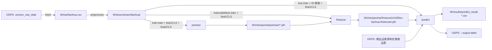

# UniSRec_1

基于 RecBole 和 PyTorch 的序列推荐项目。当前取数 SQL、商品筛选查询和默认输出表均针对 `lianhua`；模型支持预训练、微调和全量商品打分。

## 目录

```text
run.sh                         完整流程与独立阶段入口
dataset/raw/get_data_from_odps.py  从 ODPS 导出交互数据
dataset/preprocessing/        清洗交互并生成商品文本向量
data/                         RecBole 数据集、加载器和数据增强
unisrec.py                    模型和损失函数
pretrain.py                   预训练入口
finetune.py                   微调入口
predict.py                    预测和 ODPS 结果写入入口
props/                        RecBole YAML 配置
tests/                        流程入口测试
```

运行时数据和权重由 `--work-dir` 指定，不包含在仓库中。

## 环境

需要 Python、PyTorch、RecBole、Transformers、PyODPS 和项目依赖。`requirements.txt` 中的 PyTorch 为 CUDA 11.6 构建；应在匹配的 Linux/CUDA 环境中安装。文本编码器模型需提前放在本地目录，默认目录为仓库下的 `bert-base-uncased/`。ODPS 凭据文件默认位于 `/ml/output/.env`，使用 `ALI_ACCESS_ID` 和 `ALI_SECRET_ACCESS_KEY`。

## 完整流程

```bash
bash run.sh \
  --stage all \
  --dataset lianhua \
  --work-dir /ml/output \
  --plm-path /path/to/local/bert-model \
  --env-file /ml/output/.env \
  --python python3 \
  --top-k 50
```

查看参数：`bash run.sh --help`。目前完整流程只支持 `lianhua` 数据源。命令会依次：

1. 从 ODPS 导出近期交互到 `<work-dir>/raw/lianhua.csv`（日期范围以取数 SQL 为准）。
2. 过滤交互、生成训练/验证/测试原子文件，以及 `feat1CLS` 和 `feat2CLS` 商品文本向量，保存在 `<work-dir>/downstream/lianhua/`。
3. 用该数据预训练，权重保存在 `<work-dir>/checkpoints/pretrain/`，并将本次保存的模型传给微调。
4. 加载预训练权重进行微调，保存到 `<work-dir>/checkpoints/finetune/UniSRec-lianhua-finetuned.pth`。
5. 将预测 CSV 保存到 `<work-dir>/results/`，并写入 `--output-table` 指定的 ODPS 表。

## 数据流与阶段交接

以下用 `W` 表示 `--work-dir`。`--stage all` 按图中顺序执行；独立运行阶段时，从已有的上游文件继续。



| 阶段 | 读取 | 产出 |
| --- | --- | --- |
| `fetch` | ODPS `unisrec_raw_data` 的用户、商品、购买次数、日期和商品属性 | `W/raw/lianhua.csv` |
| `preprocess` | 上述 CSV 和本地文本编码器；按配置过滤交互、按时间排序并编码商品属性 | `W/downstream/lianhua/` 下的 `lianhua.train.inter`、`lianhua.valid.inter`、`lianhua.test.inter`、`lianhua.feat1CLS`、`lianhua.feat2CLS`、`index2user.json`、`index2item.json` |
| `pretrain` | `train.inter` 与两份商品文本向量 | `W/checkpoints/pretrain/` 下的 `.pth` 权重；Bash 输出本次权重路径 |
| `finetune` | 预训练权重、训练/验证原子文件与 `feat1CLS`；同时加载测试原子文件 | `W/checkpoints/finetune/UniSRec-lianhua-finetuned.pth` |
| `predict` | 微调权重、处理后的原子文件与 ID 映射；另从 ODPS 的 `unisrec_items_info` 读取商品品类，从 `lianhua_recall_station_brand_category_grade_base_tmp` 读取在售商品 | 本地预测明细 CSV；目标 ODPS 表中的 `user_id`、`prod_id`、`similarity_score` |

预训练和微调使用同一次预处理得到的 `lianhua` 数据。当前生产预处理先把用户的全部交互放入训练序列，再取末尾最多 50 个构造训练样本；验证和测试目标都取序列最后一次交互。这不是相互独立的留出划分。

任一阶段失败，脚本立即停止。预测写表会删除已有的同名 ODPS 表并重建；默认表名是 `lianhua_tmp_Unisrec_uid2simitem`。首次运行前应确认目标表和凭据指向预期环境。

## 独立运行阶段

所有阶段都通过 Bash 入口执行。单独运行时，上游产物需已存在于相同的 `--work-dir` 中；预训练完成后，命令会打印权重路径，供独立微调使用。

```bash
bash run.sh --stage fetch --work-dir /ml/output --env-file /ml/output/.env
bash run.sh --stage preprocess --work-dir /ml/output --plm-path /path/to/local/bert-model
bash run.sh --stage pretrain --work-dir /ml/output
bash run.sh --stage finetune --work-dir /ml/output --pretrained-checkpoint /path/to/pretrained.pth
bash run.sh --stage predict --work-dir /ml/output --finetuned-checkpoint /ml/output/checkpoints/finetune/UniSRec-lianhua-finetuned.pth --env-file /ml/output/.env
```

省略 `--stage` 时默认执行 `all`。`predict` 如果不传 `--finetuned-checkpoint`，会使用当前工作目录下的默认微调权重。`preprocess` 会生成预训练所需的两份文本向量。
